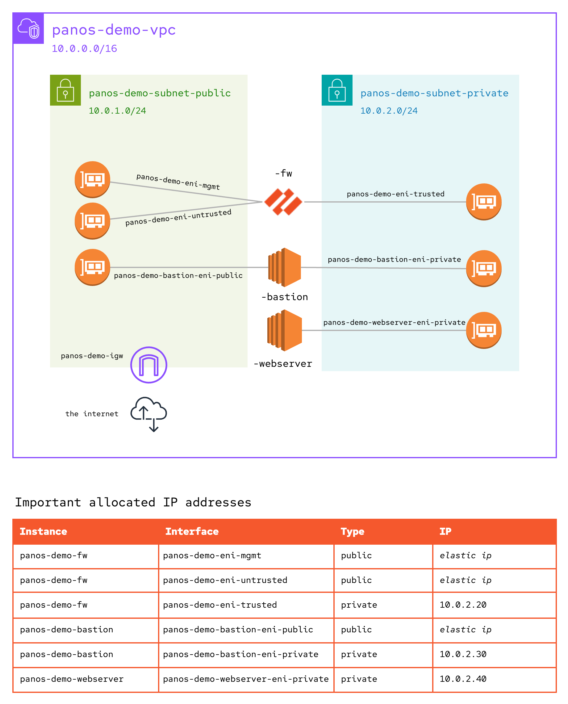

# PanOS Demo

This demo contains the Ansible content required to deploy and configure a Palo Alto (Virtual) Firewall in AWS and provision two EC2 instances serving as a bastion host and web server. The resulting network makes it possible to demonstrate use of the [paloaltonetworks.panos](https://galaxy.ansible.com/paloaltonetworks/panos) ansible collection.



Kudos to my references for this demo:
- [Eric Ames](https://github.com/ericcames/aap.dailydemo.Panos)
- [Grant Carmichael](https://evanced.net/wp-content/uploads/2015/10/Building-an-AWS-Web-Server-Farm-Protected-by-Palo-Alto-v1.pdf)
- [Palo Alto Documentation](https://docs.paloaltonetworks.com/vm-series/10-2/vm-series-deployment/set-up-the-vm-series-firewall-on-aws)

## Tested Collection Versions

| Collection | Version |
| --- | --- |
| amazon.aws | 8.2.1 |
| paloaltonetworks.panos | 2.21.2 |
| servicenow.itsm | 2.4.0 |

## Pre-requisites

In order to use these playbooks, you must have an AWS account with sufficient permissions to deploy the resources used in this demo. Additionally, the playbooks will integrate with ServiceNow ITSM if credentials are supplied. The following environment variables are expected for the playbooks to integrate with AWS and ServiceNow (optional):

| Environment Variable | Example |
| --- | --- |
| AWS_ACCESS_KEY | `AKIA...` |
| AWS_SECRET_KEY | `kasdjf938...` |
| AWS_REGION | `us-east-2` |
| SN_HOST | `https://<instance>.service-now.com` |
| SN_USERNAME | `demo-user` |
| SN_PASSWORD | `$ervicen0w` |

If you are familiar with other authentication methods for the [amazon.aws](https://galaxy.ansible.com/ui/repo/published/amazon/aws) and [servicenow.itsm](https://galaxy.ansible.com/ui/repo/published/servicenow/itsm) collections, then those should work as well if configured correctly.

### Local Setup - Python Virtual Environment

I recommend using python virtual environments for local Ansible development with `ansible-playbook` or a custom execution environment for use with `ansible-navigator`. Below is how I would setup a python virtual environment - I am covering this option as it is quicker to get started (imo):

Create a python virtual environment:
`python -m venv <venv-name>`

```bash
# Edit your <venv-name>/bin/activate script 

deactivate () {
    ...

    unset SN_HOST
    unset SN_USERNAME
    unset SN_PASSWORD

    unset AWS_ACCESS_KEY
    unset AWS_SECRET_KEY
    unset AWS_REGION
}
...

export SN_HOST="https://<instance>.service-now.com"
export SN_USERNAME="<username>"
export SN_PASSWORD="<password>"

export AWS_ACCESS_KEY="<access_key>"
export AWS_SECRET_KEY="<secret_key>"
export AWS_REGION="us-east-2"

...
```

**IMPORTANT**: Add the virtual environment to your .gitignore to ensure these files are not checked into version control. This is best practice for any repository using python virtual environments.

### Local Setup - No Virtual Environment

Run the following commands in your terminal
```bash
export SN_HOST="https://<instance>.service-now.com"
export SN_USERNAME="<username>"
export SN_PASSWORD="<password>"

export AWS_ACCESS_KEY="<access_key>"
export AWS_SECRET_KEY="<secret_key>"
export AWS_REGION="us-east-2"
```

To clear out the environment, be sure to run the corresponding `unset` commands when you are finished.

## Infrastructure Setup

Before you run this playbook, update the `panos_demo_keypair` variable in [vars/panos_infra.yml](./vars/panos_infra.yml) to match an existing key pair in the AWS region you are targeting. For more information, see guide for [Creating a Key Pair](https://docs.aws.amazon.com/AWSEC2/latest/UserGuide/create-key-pairs.html).

When you run this playbook, specify the panos firewall admin password via one of two options:

1. Using an extra variable at the command line and commenting out the vars_file entry for `panos_secrets.yml`<br>`ansible-playbook pb_infra_setup.yml -e panos_demo_password="$3cr3t"`
2. Delete and create your own vaulted `panos_secrets.yml` file with the **panos_demo_password** defined. I will not be sharing my vault password :D Assuming you are in the playbook directory,<br>`ansible-vault create vars/panos_secrets.yml`<br>`ansible-playbook pb_infra_setup.yml`

## Firewall Configuration

Once the infrastructure is stood up, you can run the firewall configuration playbook against the virtual Palo Alto Firewall in AWS. 

This playbook depends on a vaulted secrets file to supply the **panos_provider** for module authentication. Add to a vaulted secrets file the following structure:
```
# vars/panos_secrets.yml
---
panos_demo_password: $ecr3t # same password used in Infrastructure Setup
panos_provider:
  ip_address: "{{ panos_fw_mgmt_ip_address }}" # You can find this in the AWS console
  username: admin
  password: "{{ panos_demo_password }}"
```

I have these variables setup to be sourced from a custom Credential Type in AAP, so locally you will need to explicitly pass the vaulted file via a command line argument:<br>
`ansible-playbook pb_firewall_configure.yml -e @vars/panos_secrets.yml`

## Webserver Setup

This playbook can be run locally, but requires an understanding of how to use the `ProxyCommand` option for ssh. I have included an inventory configuration using the [amazon.aws.aws_ec2](https://docs.ansible.com/ansible/latest/collections/amazon/aws/aws_ec2_inventory.html) plugin to dynamically import the hosts provisioned during [Infrastructure Setup](#infrastructure-setup). Adjacent to the config, you will notice a group_vars folder with defined variables for [role_webserver](./inventory/group_vars/role_webserver.yml). These variables support the use of ProxyCommand and require you to have a single environment variable defined:

| Environment Variable | Example |
| --- | --- |
| SSH_PROXY_KEY | `~/.ssh/id_rsa` |

**IMPORTANT**: the private key referenced must be a associated with the key pair attached to both VMs (the bastion and webserver). Refer to the `panos_demo_keypair` variable in [vars/panos_infra.yml](./vars/panos_infra.yml).

Test the inventory setup:<br>`ansible-inventory --list -i inventory/`

Run the playbook and specify the dynamic inventory:<br>`ansible-playbook -i inventory/ pb_webserver_setup.yml`

### How does it work?

The key pair used to provision an ec2 puts your public key in the authorized_keys file for ec2-user. This allows us to SSH directly to the bastion host's public IP address. The webserver does not have a public IP address, but it is configured to allow SSH connections from the bastion host. The variables explained below inform Ansible to automate against any host in the **role_webserver** group (determined by the role tag) using the bastion host as an SSH proxy:

| Variable | Explanation |
| --- | --- |
| ansible_user | The target user for destination box (webserver) |
| ssh_proxy_username | The target user for proxy (bastion) |
| ssh_proxy_host | Sourcing the public_ip_address fact from the first host in the **role_bastion** group |
| ansible_ssh_private_key_file | Specifies the private key file to be used for destination box (webserver) |
| SSH_PROXY_KEY (environment) | Specifies the private key file to be use for proxy (bastion) |
| ansible_ssh_common_args | The meat of this setup - defines the SSH arguments to leverage a proxy host (heavily dependent on the variables above) |

Example rendered command:
```
ssh ... -o StrictHostKeyChecking=no -o UserKnownHostsFile=/dev/null \
  -o 'ProxyCommand=ssh -o StrictHostKeyChecking=no -o UserKnownHostsFile=/dev/null \
  -i ~/.ssh/id_rsa -W %h:%p -q ec2-user@18.191.82.190' 10.0.2.40
```

## Infrastructure Tear Down

Run the `pb_infra_teardown.yml` playbook.<br>The **panos_demo_password** is not required for this step as we are simply blowing away the AWS resources.

## Integrating with ServiceNow

Docs to come...