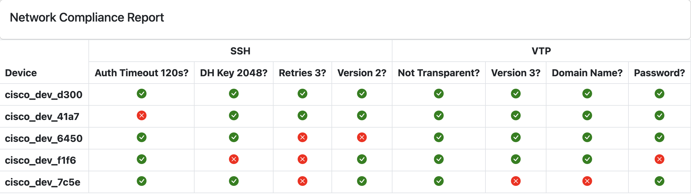

# network compliance report

This playbook processes mocked up network device [data](../vars/mock_network_data.yml) and generates a report based on specific compliance checks.

## compliance checks

1. auth timeout == 120s
1. DH key == 2048 bits
1. retries == 3
1. ssh version == 2
1. vtp op mode == transparent
1. vtp version == 3
1. vtp domain name is set
1. vtp password is set

## preview

