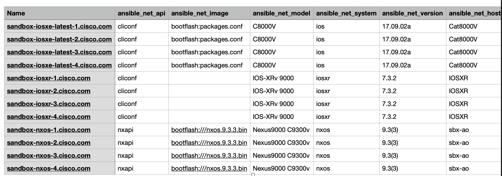

# comprehensive csv report

This playbook processes real cisco network device [facts](../vars/cisco_facts.json) gathered by ansible and generates a comprehensive csv file

## how does it work?

1. The playbook simulates gathering facts (represented with vars file) from network devices in the inventory
1. Uses lookup plugin [to_paths](https://docs.ansible.com/ansible/latest/collections/ansible/utils/to_paths_lookup.html) to get unique fact keys from all devices after flattening the json structure
1. Generates a csv file using all possible fact headers and leaves blank missing

## customize it

Out-of-the-box, this report is probably too much information. Consider modifying the jinja template or fact gathering process to hone in on particular configuration items you are interested in documenting.

## preview

