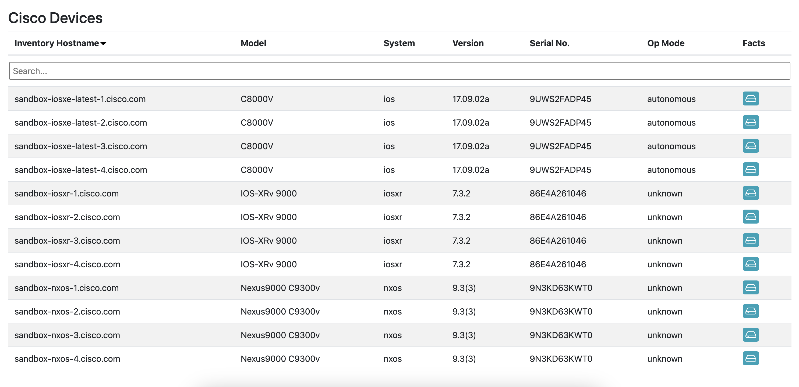
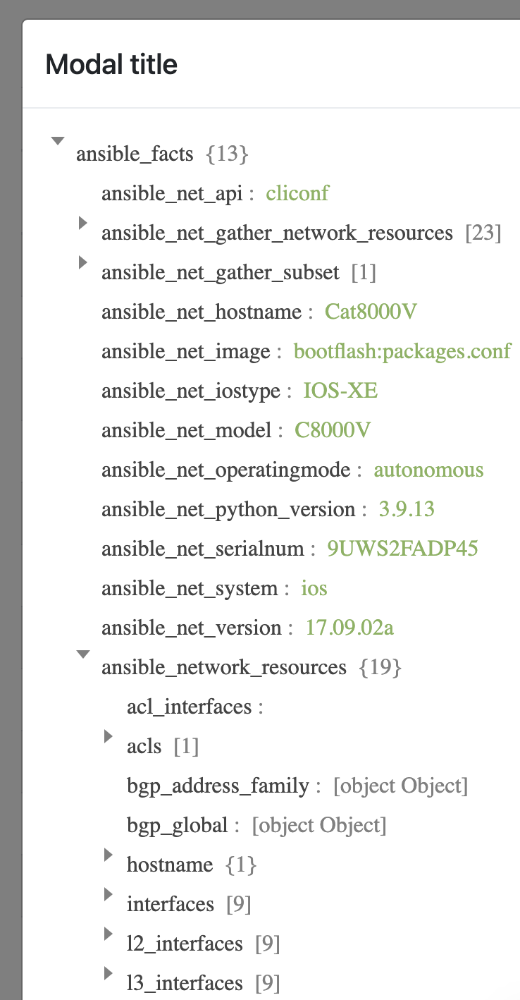

# network interactive report

This playbook processes mocked up network device [data](../vars/cisco_facts.yml) and generates an interactive report with searching, filtering, and sorting capabilities. The last column also gives users a dialog to inspect the raw facts object.

## libraries used

This template includes a few css/js libraries to keep the core simple and use available plugins to enhance the report. I leveraged libraries that I am familiar with and could quickly turn into a nicely formatted view, but there is no limit on what a developer could link - considering accessibility and load times, of course.

- Bootstrap: for styling the table (css)
- JQuery: support basic js operations
- FancyTable: easy-to-use table framework with several built-in features

## preview

 
