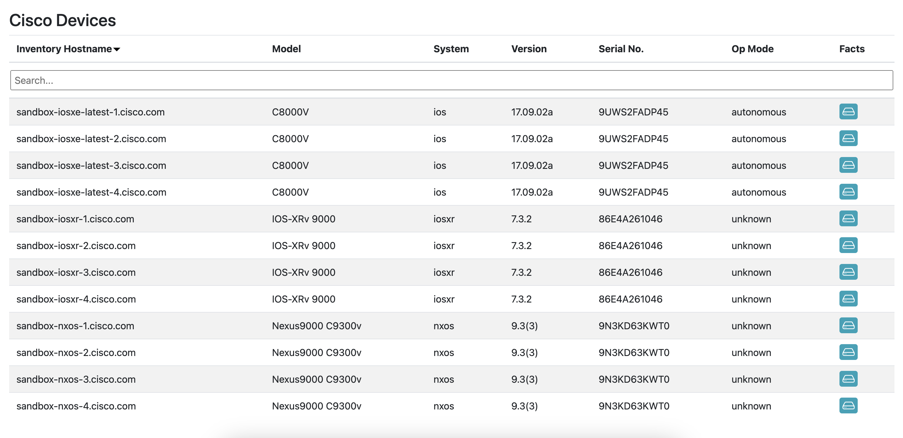
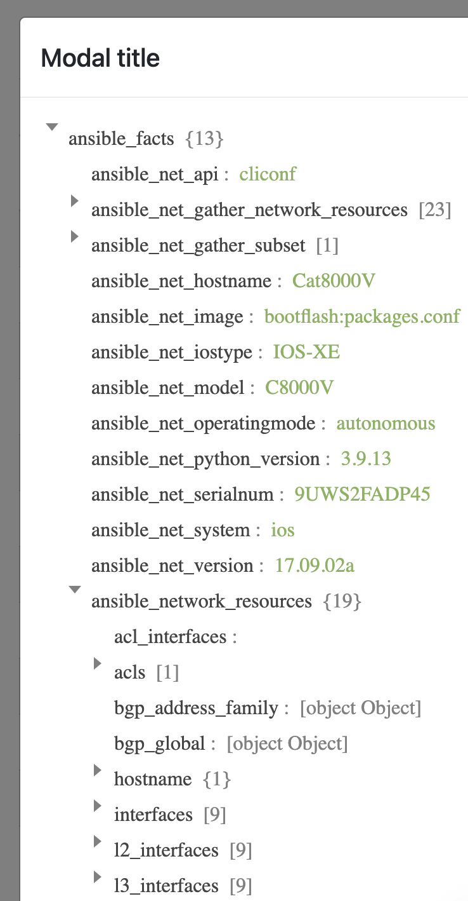

# network interactive report

This playbook processes real cisco network device data and generates an interactive report with searching, filtering, and sorting capabilities. The last column also gives users a dialog to inspect the raw facts object.

## usage

To run this playbook, you specify a `{{ _group }}` value which corresponds to a group in your inventory containing the cisco devices you want to report on.<br>

Below is an example invocation of the playbook:<br>
`ansible-playbook playbooks/interactive_report_live.yml -e "_group=cisco"`

The playbook will render the html file locally into a `dist` directory - modify the destination location to fit your needs. Ideally, this is getting published to a web server like httpd or nginx!

## how does it compare to the mock data ingestion?

The key difference is how we treat the list of devices for templating. The set_fact task to devices isolates hostvars for the group specified via `{{ _group }}`

```yaml
- name: Print device data
  ansible.builtin.set_fact:
    devices: "{{ groups[_group] | map('extract', hostvars) | list }}"
```

Minor changes were made to the Jinja2 template as the devices are provided as a list instead of a dictionary key-ed off of the inventory_hostname. This simplifies the template a bit as you simply iterate over the list of devices provided instead of looping over a list of keys and accessing the dictionary by key for each device.

## libraries used

This template includes a few css/js libraries to keep the core simple and use available plugins to enhance the report. I leveraged libraries that I am familiar with and could quickly turn into a nicely formatted view, but there is no limit on what a developer could link - considering accessibility and load times, of course.

- Bootstrap: for styling the table (css)
- JQuery: support basic js operations
- FancyTable: easy-to-use table framework with several built-in features

## preview


<br>
